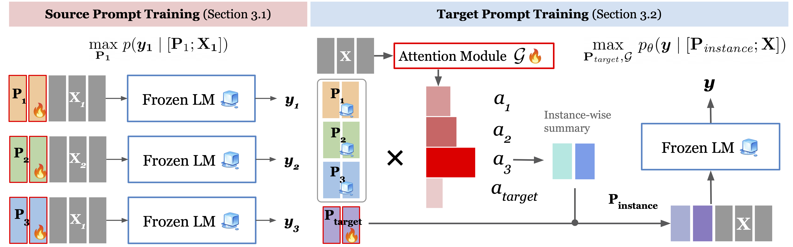

# ATTEMPT: Attentional Mixture of Prompt Tuning

This includes an original implementation of Akari Asai, Mohammadreza Salehi, Matthew E. Peters, Hannaneh Hajishirzi. "[Attentional Mixtures of Soft Prompt Tuning for Parameter-efficient Multi-task Knowledge Sharing](https://homes.cs.washington.edu/~akari/papers/attempt_preprint.pdf)" 2022.

```
@article{ asai2022attempt ,
  title={ Attentional Mixtures of Soft Prompt Tuning for Parameter-efficient Multi-task Knowledge Sharing },
  author={ Asai, Akari and Salehi, Mohammadreza, Peters, Matthew E and Hajishirzi, Hannaneh},
  journal={ arXiv preprint },
  year={ 2022 }
}
```



If you have any questions about the paper, please contact Akari Asai (akari[at]cs.washington.edu) or open an issue. 

**Note**: We are improving the code and documentations, as well as adding instructions to download pre-trained checkpoints. Please stay tuned! If you need our code & models to reproduce the results now, please feel free to contact Akari. I can share the current code via email. 
